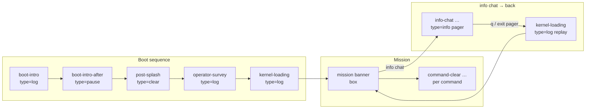

# Debug scenes (HKTM_DEBUG)

When `HKTM_DEBUG` is on (default), the CLI and browser terminal print a dim line after many full-screen transitions:

```text
[SCENE: <id> type=<kind> prev=<previousId>]
```

- **`type=clear`** — Full ANSI home clear (`\x1b[2J\x1b[H`) just ran; this line is the first content on the new screen.
- **`type=log`** — No clear; label only (e.g. scrollback continues).
- **`type=info`** — Same clear as `clear`, but marks glossary / `info` flows (`stepDebugKind: "info"` in `boxPaged`).
- **`type=pause`** — Emitted as `<slug>-after` before “Press Enter…”; **does not** advance the `prev=` chain (the next `clear` still points at the pager’s scene id).

Implementation: `src/debug-scene.mjs` (`sceneBannerLine`), used from `src/ui.mjs` / `src/ui-browser.mjs`.

## Runtime log

Set `HKTM_RUNTIME_SCENES_LOG=1` to append every scene line to `logs/runtime.log` (Node CLI). Legacy `HKTM_RUNTIME_STEPS_LOG` is read if `HKTM_RUNTIME_SCENES_LOG` is unset.

**User input (reproduction):** The same file also receives **`[ACTION: …]`** lines from the shared readline interface, in chronological order with scenes:

- **`shell`** — typed at the mission `>` prompt (commands, empty Enter, etc.).
- **`chat`** — line submitted while ShadowNet IM consumes input (`chat` gate).
- **`choice`** — line while a numbered choice UI is active (`waitForChoiceN`).
- **`operator`** — operator survey / codename one-shot capture.

Payload is the raw line (truncated to 500 chars). Set **`HKTM_RUNTIME_LOG_SEQ=1`** to prefix **every** log line (scene + action) with `[seq:N]` so ordering is obvious when merging streams.

Example:

```text
[seq:1] [SCENE: boot-intro type=log prev=none]
[seq:2] [ACTION: shell] scan
[seq:3] [SCENE: command-clear type=clear prev=post-splash]
```

## Scene flow (current)

High-level order for a **cold CLI boot** into the mission shell:



**Restore after `info` (normal mission shell):** `post-splash` (clear) → mission banner (instant, no typing replay).

**Chat gate → `info chat` → back (diagram `H` → `I` → `F`):** While the incoming-message gate is active, restore does **not** emit `post-splash` (plain clear only). After you leave the `info chat` pager (`q` / pager exit), `runTerminalLoadingSequence({ instant: true })` logs `[SCENE: kernel-loading type=log prev=<semantic> animate=false]` where `<semantic>` is the last scene id with a trailing `-exit` removed (e.g. `info-chat-exit` → `prev=info-chat`). That **kernel-loading replay** brings you back to the mission banner / shell — not a second `post-splash`.

**Phishing beat (m1):** `compose-outbound` → `smtp-handshake` (clears between stages).

**Paginated UI:** Pagers emit `<stepBase>-1`, `-2`, … per page and `<stepBase>-exit` when leaving (help, mail read, debrief, ShadowNet `chat-contract`, `info-<term>`, tutorial pager, etc.).

**Browser campaign:** Additional clears for `next-mission-banner`, `reset-mission-banner`, `ui-pip-banner`, `ui-plain-banner`.

**Checkpoints / game.mjs:** Names like `checkpoint-mission-shell`, `retry-banner`, `chat-gate-open`, `boot-mission-banner` — see `game.mjs` `clearTerminal(...)` calls.

---

*Ids are string labels in code, not an enum. When adding a new `clearTerminalScreen("your-id")`, pick a stable `your-id` and document it here if it is part of a player-visible flow.*
